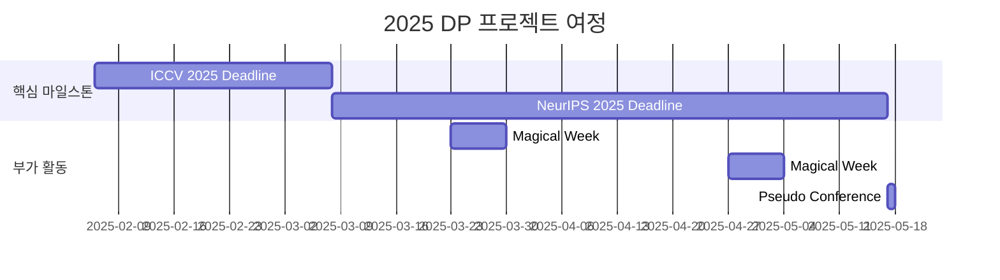

<h1 align="center"> DP (Diffusion Paper) </h1>

<div align="center">
<a href="https://pseudo-lab.com"></a>
<a href="https://discord.gg/EPurkHVtp2"></a>
<a href="https://github.com/Pseudo-Lab/10th-template/stargazers"></a>
<a href="https://github.com/Pseudo-Lab/10th-template/network/members"></a>
<a href="https://github.com/Pseudo-Lab/10th-template/pulls"></a>
<a href="https://github.com/Pseudo-Lab/10th-template/issues"></a>
<a href="https://github.com/Pseudo-Lab/10th-template/graphs/contributors"></a>
<a href="https://hits.seeyoufarm.com"></a>
</div>
<br>

<!-- sheilds: https://shields.io/ -->
<!-- hits badge: https://hits.seeyoufarm.com/ -->

> Welcome to DP repository! We aim to submit papers to the top CV/CG/ML conferences.

## 🌟 프로젝트 목표 (Project Vision)
_"Top-Tier Conferences (CVPR, ICCV, ECCV, SIGGRAPH, SIGGRAPH Asia, NeurIPS, ICLR, ICML)에 논문 투고하기"_  
- Diffusion / RF 관련 프로젝트
- 세상에 필요한 기술 / 아직까지 해결하지 못한 문제를 정의하고, 새로운 방법으로 해결

## 🧑 역동적인 팀 소개 (Dynamic Team)

| 역할          | 이름 | 주요 관심 분야                          | 소개 링크 |
|---------------|------|----------------------------------------|-------|
| **Project Manager** | 김건호 | 3D Vision, Graphics, Generative Model | [Link](https://soulmates2.github.io/) |
| **Member** | 김현진 | 3D Vision, Graphics, Generative Model | [Link](https://kormachine.github.io/) |


## 🚀 프로젝트 로드맵 (Project Roadmap)



## 🛠️ 우리의 개발 문화 (Our Development Culture)
**우리의 개발 문화**  
```python
class CollaborationFramework:
    def __init__(self):
        self.tools = {
            'communication': 'Discord',
            'version_control': 'GitHub Projects',
            'ci/cd': 'GitHub Actions',
            'docs': 'Github Wiki'
        }
    
    def workflow(self):
        return """주간 사이클:
        Do research
```


## 📈 성과 지표 (Achievement Metrics)
**2024 주요 KPI**  
| 지표                     | 목표치 | 현재 달성률 |
|--------------------------|--------|-------------|
| 논문 투고                  | 1      | 0%          |
| 논문 게재                  | 1      | 0%          | 


## 💻 주요 데드라인 (Conference Deadlines)

| 날짜 | 내용 |
| ---------- | -------- |
| 2025/03/07 | ICCV 2025 Deadline    |
| 2025/05/16 | NeurIPS 2025 Deadline | 


## 🌱 참여 안내 (How to Engage)
**현재 모집 인원을 받고 있지 않습니다🥲 연구관련 협업은 (프로젝트 매니저)[https://soulmates2.github.io/]에게 연락주세요!**  

## Acknowledgement 🙏

DP is developed as part of Pseudo-Lab's Open Research Initiative. Special thanks to our contributors and the open source community for their valuable insights and contributions.

## About Pseudo Lab 👋🏼</h2>

[Pseudo-Lab](https://pseudo-lab.com/) is a non-profit organization focused on advancing machine learning and AI technologies. Our core values of Sharing, Motivation, and Collaborative Joy drive us to create impactful open-source projects. With over 5k+ researchers, we are committed to advancing machine learning and AI technologies.

<h2>Contributors 😃</h2>
<a href="https://github.com/Pseudo-Lab/DP_Diffusion_Paper/graphs/contributors">
  
</a>
<br><br>

<h2>License 🗞</h2>

This project is licensed under the [MIT License](https://opensource.org/licenses/MIT).
